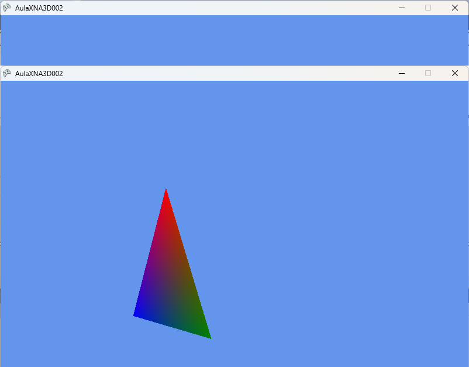

# XNA_002_TRANSFORMACOES

Este repositório contém o projeto didático **AulaXNA3D002**, o segundo passo no estudo de Computação Gráfica 3D utilizando a linguagem **C#** e o framework **Microsoft XNA Game Studio 4.0**.

O objetivo deste projeto é demonstrar a aplicação prática de **Transformações Geométricas 3D** (Escala, Rotação e Translação) sobre uma primitiva (triângulo 3D), além de introduzir conceitos de herança e controle de estados de rasterização (culling).

---

## 📸 Resultado Esperado



*Nota: A imagem acima representa o resultado das transformações animadas aplicadas sobre o triângulo 3D.*

---

## 🛠️ Como o Projeto Funciona

O projeto estende a base da primeira aula, organizando as transformações através de herança:

### 1. [`_TransformTriangle.cs`](AulaXNA3D002/AulaXNA3D002/AulaXNA3D002/_TransformTriangle.cs) (Novo)
Esta classe herda de [`_Triangle.cs`](AulaXNA3D002/AulaXNA3D002/AulaXNA3D002/_Triangle.cs) e implementa a lógica das transformações de mundo em tempo de execução:
* **Atualização (`Update`)**: O ângulo de rotação é incrementado a cada quadro com base no tempo decorrido (`gameTime`). A matriz de mundo (`world`) é calculada aplicando três transformações sequenciais:
  1. **Escala (Y)**: Redimensiona o triângulo no eixo Y de forma oscilatória usando a função seno: `Matrix.CreateScale(1, auxScale, 1)`.
  2. **Rotação (Y)**: Rotaciona o triângulo em torno do eixo vertical Y: `Matrix.CreateRotationY(angle)`.
  3. **Translação (X)**: Move o triângulo lateralmente no eixo X de forma senoidal: `Matrix.CreateTranslation(dx, 0, 0)`.
  
  Matematicamente, a composição das matrizes é calculada na ordem:
  \[M_{World} = M_{Scale} \times M_{RotationY} \times M_{TranslationX}\]

* **Rasterizer State (Desenho)**: Sobrescreve o método `Draw` para desativar a remoção de faces traseiras (`RasterizerState.CullMode = CullMode.None`). Isso garante que ambas as faces do triângulo sejam renderizadas enquanto ele gira.

### 2. [`Game1.cs`](AulaXNA3D002/AulaXNA3D002/AulaXNA3D002/Game1.cs)
Gerencia o fluxo principal do jogo:
* **Atualização**: Chama o método `triangle.Update(gameTime)` a cada tick, atualizando as transformações.
* **Desenho**: Limpa a tela com `Color.CornflowerBlue` e desenha o triângulo transformado utilizando a projeção da câmera.

### 3. [`_Triangle.cs`](AulaXNA3D002/AulaXNA3D002/AulaXNA3D002/_Triangle.cs)
Classe base que define a geometria do triângulo com vértices coloridos interpolados (Vermelho, Verde e Azul) e gerencia o `VertexBuffer` e o `BasicEffect`. Suas propriedades foram definidas como `protected` para permitir o acesso e manipulação da matriz `world` pela classe filha.

### 4. [`_Camera.cs`](AulaXNA3D002/AulaXNA3D002/AulaXNA3D002/_Camera.cs) e [`_Screen.cs`](AulaXNA3D002/AulaXNA3D002/AulaXNA3D002/_Screen.cs)
Mantêm as mesmas funcionalidades da aula anterior: a câmera posicionada em `(0, 0, 5)` com projeção perspectiva de 45° (\(\pi / 4\)) e a tela estruturada como um padrão Singleton.

---

## 💻 Requisitos do Sistema

* **Sistema Operacional**: Windows 7, 8, 10 ou 11 (com runtimes do XNA e DirectX 9 instalados).
* **IDE**: Microsoft Visual Studio 2010.
* **Framework**: Microsoft XNA Game Studio 4.0.
* **Dependência**: .NET Framework 4.0 Client Profile.

---

## 🚀 Como Executar

1. Clone este repositório:
   ```bash
   git clone https://github.com/FCA-GAMEDEV/XNA_002_TRANSFORMACOES.git
   ```
2. Abra o arquivo `AulaXNA3D002.sln` localizado na pasta `AulaXNA3D002` utilizando o Visual Studio 2010.
3. Pressione `F5` para compilar e rodar a animação interactiva das transformações 3D.
